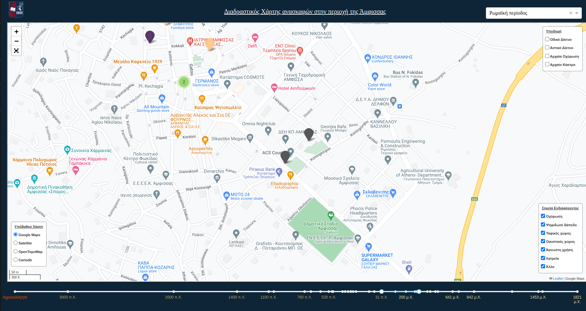
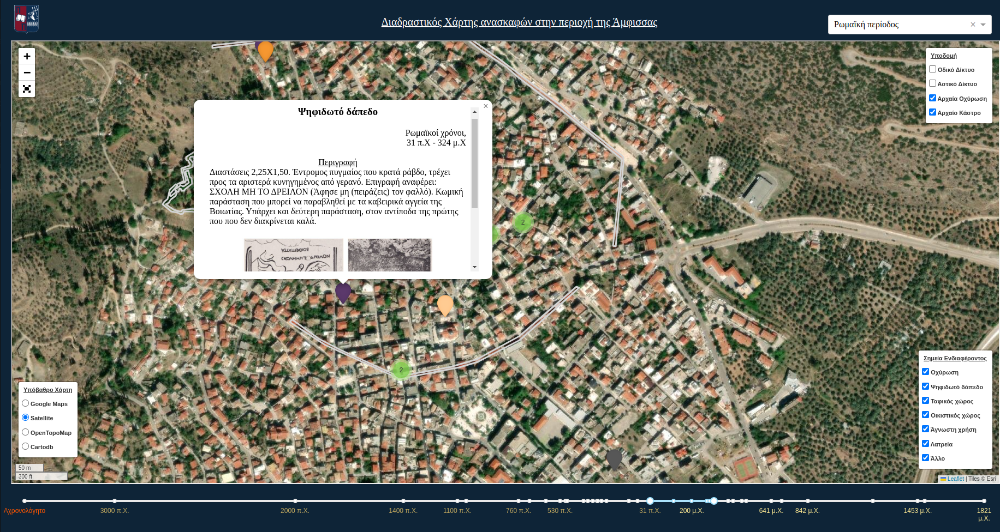

# Amfissa Web Map

This project creates a web map to visualize excavations in the Amfissa region. The map provides an interactive interface for users to explore different archaeological sites and their historical context.

## Description

The Amfissa Web Map project aims to provide a comprehensive view of excavations in the Amfissa region, allowing users to discover and learn about ancient sites. The web map incorporates geospatial data and historical information to provide an immersive experience for users interested in archaeology.

## Features

- Interactive map displaying excavations in the Amfissa region
- Historical timeline to explore different time periods
- Filtering options based on excavation categories and periods
- Detailed information and images for each archaeological site
- User-friendly interface with intuitive controls

## Installation

1. Clone the repository:

   ```bash
   git clone <repository_url>
2. Navigate to the project directory: 

    ```bash
    cd amfissa_webmap
3. Install the required dependencies:

    ```bash
    pip install -r requirements.txt
4. Run the web map: 

    ```bash
    python app.py
5. Open a web browser and visit the following URL:

    ```bash
    http://localhost:8080/
## File Structure

The project has the following file structure:
amfissa_webmap/
  ├── app.py
  ├── data/
  │   ├── excavations.geojson
  │   ├── categories.json
  │   └── timeline.json
  ├── templates/
  │   └── index.html
  └── assets/
      ├── images/
      └── styles/
## License

This project is licensed under the MIT License - see the LICENSE file for details.

## Screenshots

